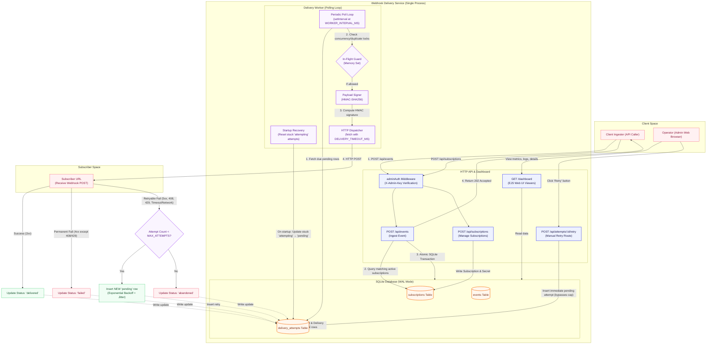

# Webhook Delivery Service

A single-process webhook delivery service built with Node.js + TypeScript. Accepts events, fans them out to matching subscriptions, retries failed deliveries with exponential backoff + jitter, and exposes an admin dashboard.
---

## System Architecture

Below is the high-level architecture of the webhook delivery service, outlining event ingestion, the persistent SQLite WAL transaction, the asynchronous polling worker, payload signing, retry logic, crash recovery, and the admin dashboard.



---

## Quick Start

```bash
# 1. Clone and install
git clone <repo-url>
cd assigment_webhook
npm install

# 2. Create your local config from the template
cp .env.example .env
#    → Edit .env to set ADMIN_KEY and any other settings you want to change

# 3. Start the development server (auto-restarts on file changes)
npm run dev
```

The server starts on **http://localhost:3000**. The SQLite database file (`webhook.db`) is created automatically the first time the server starts. You do not need to run any migrations.

```
🚀 Webhook Delivery Service
   API:       http://localhost:3000/api
   Dashboard: http://localhost:3000/dashboard
   Admin key: change-me-in-production
```

> **First thing to do:** open `.env`, change `ADMIN_KEY` to something secret, and use that key in the `X-Admin-Key` header on every API request.

---

## Running in Production

```bash
# Compile TypeScript → dist/
npm run build

# Run the compiled output
npm start
```

Make sure `.env` exists (or export the variables directly) before running `npm start`.

---

## Running Tests

```bash
npm test
```

Tests use an in-memory SQLite database (`DB_PATH=:memory:`) and a fixed admin key — no `.env` needed, no files created on disk.

**Results: 33 tests, 4 suites — all pass.**

| Suite | Tests | What it covers |
|---|---|---|
| `signing.test.ts` | 10 | HMAC-SHA256 `sign()` and `verify()` — format, determinism, tamper detection |
| `matching.test.ts` | 6 | Glob pattern matching — exact, wildcard, `order.*`, nested `user.*.created` |
| `worker.test.ts` | 6 | Backoff formula — values at attempts 1–4, 1-hour cap, jitter range |
| `api.test.ts` | 11 | Full HTTP flows — create, list, fan-out, deactivate, 401, retry |

---

## Environment Variables

Copy `.env.example` to `.env` and edit the values. Every variable has a working default so you can start without changing anything.

```bash
cp .env.example .env
```

| Variable | Default | Required? | Description |
|---|---|---|---|
| `PORT` | `3000` | No | HTTP port the server listens on |
| `DB_PATH` | `./webhook.db` | No | Path to the SQLite database file. Created automatically if it doesn't exist. Use `:memory:` for a transient in-memory DB (tests only — data lost on restart). |
| `ADMIN_KEY` | `change-me-in-production` | **Yes (change it)** | Shared secret sent by callers as the `X-Admin-Key` header on every API request. The default intentionally looks like a placeholder — change it before exposing the service to any network. |
| `MAX_ATTEMPTS` | `5` | No | How many delivery attempts are made before an attempt is permanently marked `abandoned`. The first attempt is immediate; subsequent ones use exponential backoff. After this limit, an operator can still manually retry from the dashboard. |
| `WORKER_INTERVAL_MS` | `2000` | No | How often the delivery worker wakes up to check for due attempts, in milliseconds. Lower values reduce delivery latency; higher values reduce DB read pressure. |
| `DELIVERY_TIMEOUT_MS` | `5000` | No | Maximum time, in milliseconds, to wait for a subscriber's HTTP response. If the subscriber doesn't respond within this window, the request is aborted and the attempt is retried with backoff (treated as a network error, not a permanent failure). |
| `WORKER_CONCURRENCY` | `50` | No | Maximum number of in-flight HTTP deliveries at any one time within a single poll cycle. Raising this increases throughput; lowering it reduces outbound connection pressure. |

**Example — custom port and key:**

```bash
# Inline (one-off)
PORT=8080 ADMIN_KEY=supersecret npm run dev

# Or set in .env (recommended)
echo "PORT=8080\nADMIN_KEY=supersecret" >> .env
npm run dev
```

---

## API Reference

All API endpoints require the header `X-Admin-Key: <your-key>` (the value of `ADMIN_KEY` in your `.env`).

### Subscriptions

#### Register a subscription
```
POST /api/subscriptions
Content-Type: application/json
X-Admin-Key: change-me-in-production

{
  "target_url":   "https://your-server.com/webhook",  // required, must be a valid URL
  "secret":       "your-signing-secret",              // optional — enables HMAC-SHA256 signing
  "event_filter": "order.*"                           // optional — glob pattern, default: "*"
}
```

**Response `201`:**
```json
{
  "id":           "uuid",
  "target_url":   "https://your-server.com/webhook",
  "secret":       "your-signing-secret",
  "event_filter": "order.*",
  "created_at":   1700000000000,
  "is_active":    1
}
```

#### List all subscriptions
```
GET /api/subscriptions
X-Admin-Key: change-me-in-production
```

#### Get a single subscription
```
GET /api/subscriptions/:id
X-Admin-Key: change-me-in-production
```

#### Deactivate a subscription (soft-delete)
```
DELETE /api/subscriptions/:id
X-Admin-Key: change-me-in-production
```

Deactivated subscriptions (`is_active = 0`) stop receiving new events. Their history and existing attempts are preserved. This is intentionally a soft-delete — hard-deleting would orphan delivery attempt rows.

---

### Events

#### Ingest an event
```
POST /api/events
Content-Type: application/json
X-Admin-Key: change-me-in-production

{
  "type": "order.created",
  "data": { "orderId": "ORD-001", "amount": 99.99 }
}
```

**Response `202`:**
```json
{
  "id":                    "uuid",
  "type":                  "order.created",
  "matched_subscriptions": 2,
  "message":               "Event accepted. Delivery queued for 2 subscription(s)."
}
```

The event insert and all delivery attempt rows are created in a **single SQLite transaction** before the 202 is returned. If the process crashes after responding, the attempts are already on disk and will be picked up on the next poll cycle.

#### List recent events
```
GET /api/events?limit=50&offset=0
X-Admin-Key: change-me-in-production
```

#### Get a single event
```
GET /api/events/:id
X-Admin-Key: change-me-in-production
```

---

### Delivery Attempts

#### List attempts for an event
```
GET /api/attempts?eventId=<event-id>
X-Admin-Key: change-me-in-production
```

#### List attempts for a subscription
```
GET /api/attempts?subscriptionId=<subscription-id>
X-Admin-Key: change-me-in-production
```

#### Manually retry a failed or abandoned attempt
```
POST /api/attempts/:id/retry
X-Admin-Key: change-me-in-production
```

Creates a new `pending` attempt scheduled for immediate delivery. Manual retries bypass the `MAX_ATTEMPTS` cap — the operator is making an explicit decision. Returns `409` if the attempt is already `pending` or `attempting`.

---

### Health

```
GET /health
```
No auth required. Returns `{ "status": "ok", "timestamp": <unix-ms> }`. Use this for uptime monitoring.

---

## Dashboard

Open **http://localhost:3000/dashboard** in a browser — no auth required (it's assumed to be an internal admin tool).

### Pages and Capabilities

| Page | URL | Interactive Actions |
|---|---|---|
| Subscriptions | `/dashboard` | View all active/inactive subscriptions, stats, and **register a new subscription** using the inline form. |
| Subscription Detail | `/dashboard/subscriptions/:id` | View configuration and logs, trigger manual retries for failed attempts, and **deactivate the subscription** directly. |
| Events | `/dashboard/events` | Browse event history, search by type, and **trigger/ingest a new test event** via the inline JSON console form. |
| Event Detail | `/dashboard/events/:id` | View the JSON payload and detailed attempt outcomes (status codes, errors, raw headers, signature status). |

### Interactive Testing (No Postman Required!)

You can test the entire system's functionality directly from the dashboard:
1. **Register a Subscription:** Go to the Subscriptions tab and enter a target URL (e.g., `https://httpbin.org/post`), an event pattern (e.g., `order.*`), and an optional signing secret.
2. **Trigger an Event:** Go to the Events tab, specify the event type (e.g., `order.created`), customize the JSON payload, and click **Trigger Event**.
3. **Inspect/Retry Delivery:** Go to the event's detail page to monitor its delivery. If it failed, click the **↩ Retry** button to re-trigger it.
4. **Deactivate:** Go to the subscription's detail page and click **Deactivate Subscription** to stop the worker from delivering new events or retrying attempts.

---

## Event Filter Patterns (Glob)

The `event_filter` field uses [`minimatch`](https://github.com/isaacs/minimatch) glob syntax:

| Filter | Matches | Does not match |
|---|---|---|
| `*` | everything | — |
| `order.created` | `order.created` | `order.updated` |
| `order.*` | `order.created`, `order.updated` | `user.created`, `order` |
| `user.*.created` | `user.profile.created`, `user.settings.created` | `user.created` |

---

## Payload Signing (HMAC-SHA256)

When a subscription has a `secret`, every delivery includes two additional headers:

```
X-Webhook-Signature: sha256=<hex-digest>
X-Webhook-Timestamp: <unix-ms-timestamp>
```

The signature is computed over the concatenation of the timestamp and the body:

```
signature = HMAC-SHA256(secret, "${timestamp}.${body}")
```

Including the timestamp in the signed payload means the signature is unique per delivery, which prevents **replay attacks** — an attacker who captures a valid delivery cannot re-send it with the same signature.

**Subscriber verification example (Node.js):**

```js
const crypto = require('crypto');

function verifyWebhook(req, secret) {
  const timestamp = req.headers['x-webhook-timestamp'];
  const signature = req.headers['x-webhook-signature'];
  const body = req.rawBody; // use raw body string, not re-serialised JSON

  // 1. Reject stale deliveries (replay protection window: 5 minutes)
  if (Math.abs(Date.now() - Number(timestamp)) > 5 * 60 * 1000) {
    return false; // timestamp too old or in the future
  }

  // 2. Recompute expected signature
  const expected = 'sha256=' + crypto
    .createHmac('sha256', secret)
    .update(`${timestamp}.${body}`)
    .digest('hex');

  // 3. Constant-time comparison — prevents timing-based side-channel attacks
  const a = Buffer.from(expected, 'utf8');
  const b = Buffer.from(signature, 'utf8');
  if (a.length !== b.length) return false;
  return crypto.timingSafeEqual(a, b);
}
```

> **Important:** always use the **raw** request body string for verification — not `JSON.stringify(req.body)`. JSON re-serialisation can change key ordering or whitespace, producing a different string and a signature mismatch.

---

## Retry Policy

When a delivery fails, a **new attempt row** is inserted with a scheduled time in the future, calculated using exponential backoff with random jitter:

```
delay = min(2^(attemptNumber - 2) × 10,000 ms  +  random(0, 5,000 ms),  3,600,000 ms)
```

### Backoff schedule (with `MAX_ATTEMPTS=5`, jitter zeroed)

| Attempt | Delay after previous failure | Cumulative time from first attempt |
|---|---|---|
| #1 | immediate | 0s |
| #2 | ~10 s | ~10 s |
| #3 | ~20 s | ~30 s |
| #4 | ~40 s | ~70 s |
| #5 | ~80 s | ~2.5 min |
| abandoned | — | — |

Each delay has up to **5 seconds of random jitter** added on top. This spreads retries across time when many subscriptions fail simultaneously (e.g., a subscriber deployment takes down a whole endpoint), preventing a thundering herd of simultaneous retries from overwhelming a recovering server.

The cap is **1 hour** — a retry will never be scheduled more than 60 minutes into the future, regardless of attempt number.

### Response classification

| HTTP response | Treatment | Reason |
|---|---|---|
| `2xx` | ✅ **Delivered** — done | Success |
| `4xx` (except 408, 429) | ❌ **Permanent failure** — no retry | `400`, `401`, `403`, `404`, `410`, etc. are configuration or authorisation errors. Retrying 5 times won't fix a wrong URL or a missing permission. |
| `408` Request Timeout | 🔄 **Retryable** | The server timed out waiting for the request — a transient infrastructure condition, not an application error. |
| `429` Too Many Requests | 🔄 **Retryable** | An explicit backpressure signal from the subscriber asking us to slow down. Retrying with backoff is the correct response. |
| `5xx` | 🔄 **Retryable** | Server-side error — typically transient (deploy, crash, overload). |
| Network error / timeout | 🔄 **Retryable** | Connection refused, DNS failure, our own `DELIVERY_TIMEOUT_MS` firing, etc. |

### What happens after `MAX_ATTEMPTS`

The attempt is marked `abandoned`. No further automatic retries are scheduled. An operator can manually trigger a retry from the dashboard or via `POST /api/attempts/:id/retry` at any time — manual retries bypass the cap.

---

## Crash Recovery

The delivery worker marks each attempt `'attempting'` in the database **before** making the outbound HTTP request. If the process crashes mid-request:

1. The row stays in `'attempting'` status on disk.
2. On the **next startup**, the worker runs a single recovery query:
   ```sql
   UPDATE delivery_attempts SET status = 'pending' WHERE status = 'attempting'
   ```
3. Those attempts are picked up by the next poll cycle and retried.

The startup log tells you if recovery happened:
```
[worker] 🔄 Recovered 3 in-flight attempt(s) from prior crash
```

**At-least-once guarantee:** the HTTP request may have completed successfully just before the crash, meaning the subscriber already received the event. The subscriber should use the `X-Webhook-Delivery-Id` header (unique per attempt) to deduplicate if needed.

---

## What Works

- ✅ Subscription registration with URL, optional secret, and glob event filter
- ✅ Event ingest with atomic fan-out (durability guaranteed before 202 response)
- ✅ Delivery worker with exponential backoff + jitter, configurable concurrency
- ✅ Crash recovery — in-flight attempts reclaimed automatically on next startup
- ✅ Correct HTTP response classification (408/429 retryable; other 4xx permanent)
- ✅ HMAC-SHA256 payload signing with replay-attack protection via timestamp
- ✅ Manual retry from dashboard (bypasses attempt cap, works on failed/abandoned)
- ✅ Soft-delete subscriptions — deactivation preserves history, stops fan-out
- ✅ Dashboard: subscription list, event log with filter, event detail, subscription detail
- ✅ 33 automated tests — signing, matching, backoff, and full API HTTP flows

---

## What's Incomplete / Known Limitations

- **No real-time dashboard updates** — server-rendered pages require a manual refresh to see new delivery results. SSE or WebSocket push would be the natural next step.
- **Secrets stored in plaintext** — subscription secrets sit unencrypted in SQLite. In production, secrets should be encrypted at rest (e.g., AES-256-GCM with a KMS-managed key).
- **No subscription update endpoint** — to change a URL or filter you must deactivate and re-create the subscription. A `PATCH /api/subscriptions/:id` is a straightforward addition.
- **Single writer throughput** — SQLite serialises writes. Very high fan-out (thousands of subscriptions per event) would see INSERT contention. The fix is a single batched `INSERT … VALUES (…),(…)` or migrating to Postgres.
- **No pagination on subscription list** — fine at small scale; needs `LIMIT/OFFSET` as the list grows.

---

## What I'd Do Next With More Time

1. **Encrypt secrets at rest** — application-level AES-256-GCM on the `secret` column, key stored outside the DB.
2. **Batch attempt inserts on fan-out** — replace the per-subscription INSERT loop with one multi-row INSERT to handle high-cardinality fan-outs efficiently.
3. **SSE real-time dashboard** — `GET /dashboard/stream` pushes attempt status changes so operators see deliveries resolve live without refreshing.
4. **Subscription update endpoint** — `PATCH /api/subscriptions/:id` for in-place URL, filter, and secret updates.
5. **Rate limiting on ingest** — per-key limits to prevent the ingest endpoint from being used as a fan-out amplifier or DoS vector.
